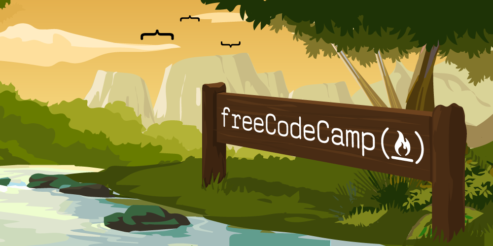
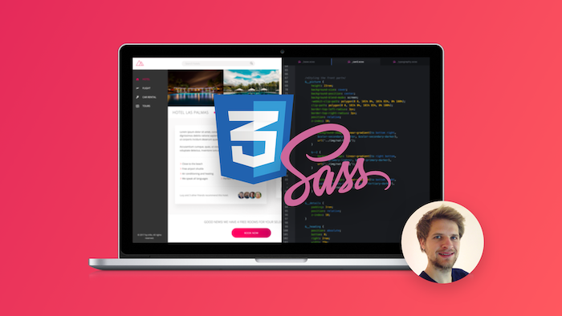
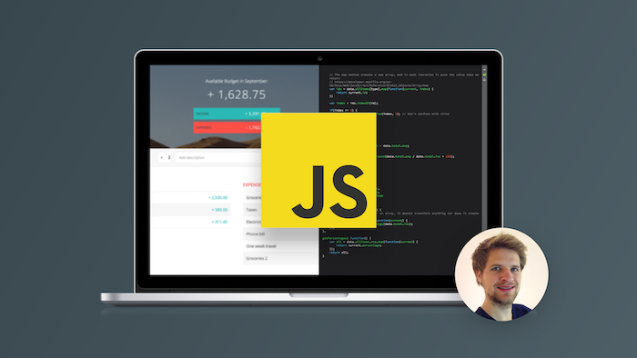

## 5 Actionable Tips To Help You Get The Most Out Of Your Business Website in 2020
---

As a career option, web development has exploded in popularity in recent years, so it makes sense that there is an abundance of resources popping up to help dev-to-be’s with their new career goals. So how do we know what makes a good learning resource?

In short, it depends. It’s not going to be the same for everyone, some prefer books, some like to get their hands dirty and learn by building things with a DIYer approach,some like to be guided through concepts with video courses and code-alongs, and given the chance to build on the key concepts they’ve learned. On my journey so far I’ve learnt that context is key. Without context you lack the ability to see where a concept may fit into a real-world application and consequently may not see the value in the information being learned.

So, with that information in mind, here’s my top 5 resources that you can use to get started on your journey today.
 

## FreeCodeCamp

The open source, non-profit that is FreeCodeCamp is a firm favourite for many self-taught and bootcamp peppers alike, especially for those who prefer to learn by getting stuck in and solving problems.

The FCC guided curriculum utilises coding challenges to teach programming syntax, problem solving skills and logical thinking. This, coupled with the real-world projects that are a prerequisite for obtaining the sought after certifications make FCC an extremely appealing offer for anybody from beginners to those with a little more experience looking to refine their skills.
 

## Jonas Schmedtmann’s Advanced CSS and SASS Course

If you’ve got an eye for design and want to make beautiful websites filled with fluid animations and fantastic colour schemes, Jonas’s course is where you want to start. This course provides a comprehensive guide through basic CSS all the way to more advanced topics such as naming conventions, Flexbox and CSS Grid. You’ll also get to dip your toes into SASS, the CSS pre-processer of choice for many modern developers. Jonas also provides some in-depth code-along projects to develop a fundamental knowledge of responsive design, all whilst providing you with projects perfectly suited for a new developers portfolio.
 

## Jonas Schmedtmann’s The Complete JavaScript Course 2020: Build Real Projects!

This course, covering Javascript from front-to-back is great if you enjoy creating real-world, applicable projects taught in a clear and fun way. Jonas concisely breaks down concepts into easily digestible chunks and repeats them often enough that you’ll be sure to hold onto the information being taught. Furthermore, Jonas includes an additional bonus Node.js crash course to round off the end of the course.

Not to mention, you’ll have a few more interactive projects to add to your new developer portfolio.
 

## Javascript 30 with Wes Bos

With his series of 30 videos Wes provides a great tool for refining your existing Javascript knowledge. With a relatively simple concept, 30 tutorials intended to be completed in 30 days, Wes guides you through some of the trickier aspects of Javascript by building fun projects such as a keyboard drum kit, Ajax type-ahead feature and responsive image gallery using Flexbox.
 

## An Introduction To Git: What It Is, And How To Use It

Version control is a key topic newer developers should be getting familiar with. There’s no doubt that when you enter the job market you’ll be joining a team working alongside multiple other developers, for this reason version control systems like Git are crucial in minimising code conflicts between your team. In this comprehensive blog post, Aditya Sridhar covers the git basics from installing git via the command line to the various Git commands you’re certainly going to need throughout your career.

## Conclusion

If you're considering learning how to code I would strongly recommend using a combination of the resources I mentioned above, different teachers use varying teaching styles, so find one you love and stick with it, and good luck!

## Additional Resources:

### Books:

- Eloquent Javascript

- Javascript Grammar

- Javascript Allonge

- Learn HTML & CSS - Design and Build Websites

### Youtube

- Level Up Tuts

- Wes Bos

- Traversy Media

- Fun fun function

- Colt Steele

### Blogs:

- WeLearnCode

- FreeCodeCamp Blog

- Dev.to

### Podcasts:

- SyntaxFM

- CodeNewbie

- LTCWM

- Ladybug Podcast

## Don't Want To Do It Yourself?

I can help! For more information on how you can get a professional quality website, including all of the tips you've just seen above, you can contact me on [mrobinsonwebdev@gmail.com](mailto:mrobinsonwebdev@gmail.com).

Alternatively, you can click [here](/contact/) and submit a contact query. I'll get back to you just as soon as I can!

You can also check out some of my previous client work and personal projects [here](/).
 
Friday, December 6, 2019

