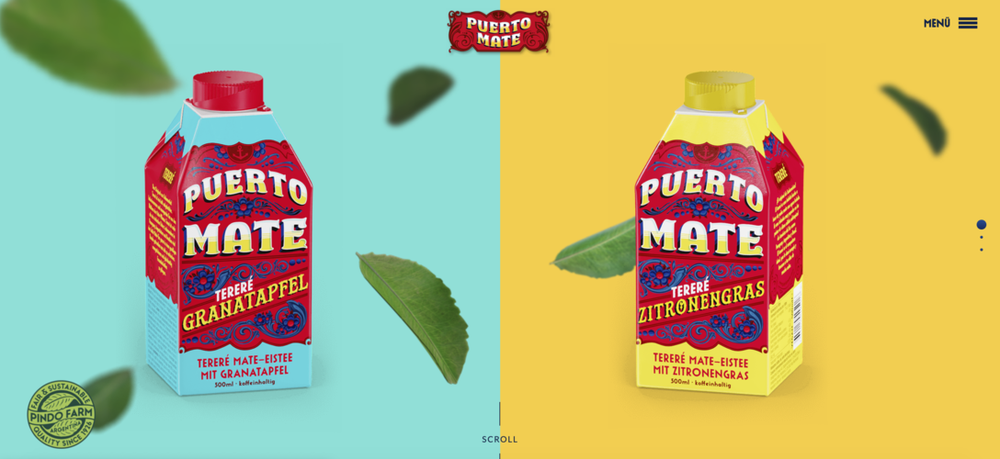
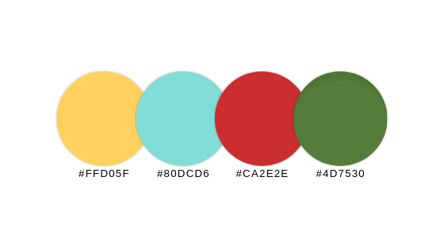
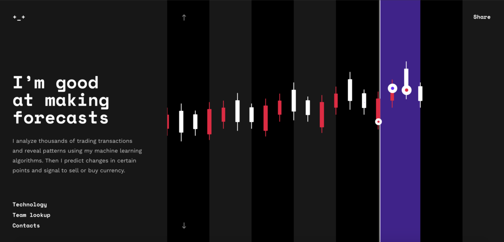
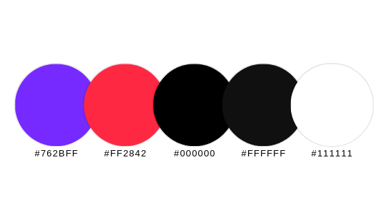
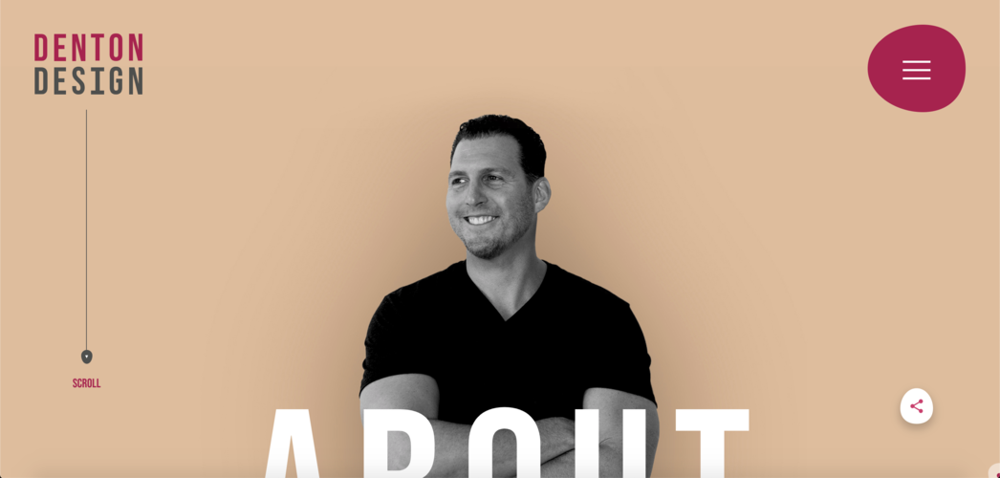
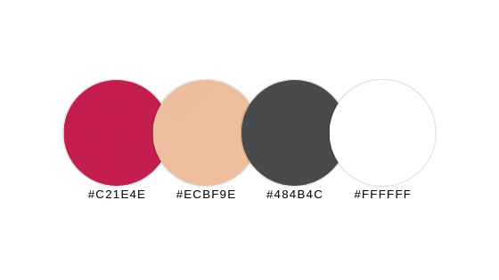

## An exciting colour pallette is essential for completing your brand image, here's some examples to get your creative juices flowing
---

I know in my last [blog post](/2019/14-09-2019-how-to-get-the-most-out-of-your-website-in-2020/) I told you that content is key for bringing users into your website, but what I didn’t tell you is that we’re still missing one key piece of the puzzle. Colour.

People definitely love consuming content, but a fresh, exciting colour palette is vital in intriguing potential readers and bringing them into your website. If you think about it, it’s not rocket science. The more an item stands out, the more likely it is to be noticed. Otherwise known as the [Isolation Effect](https://www.abtasty.com/blog/isolation-effect/), this psychological phenomenon can help you increase customer engagement and even conversions.

Now you know why a fresh colour palette could be the right design choice for your website, let me show you my 3 favourite colour schemes for 2020:

## Puerto Mate

 

2019 was the year of vivid, powerful colours, which means designs were more eye-catching than ever. [Puerto Mate](https://www.puertomate.com/) is a fine example, using an intense, but not overwhelming colour palette to hook readers into an engaging, interactive experience with their website full of custom shapes and dynamic scrolling effects.

### Here's the palette:

---

## Crypton
 

 

On occasion, less it not more. Crypton uses a lengthy colour palette showing some vibrant, vivid colours in an attempt to step away from the past trends of 2018. A striking colour palette complements the exciting JavaScript-fuelled animations used in this website for an energetic ride from start-to-finish.

### Here's the palette:

---

## Nate Denton Designs

 

With a splash of intensity surrounded by neutrality, this website for designer Nate Denton Designs uses an unusual combination of soft tones to bright, punchy pinks. Nate promotes an energising user experience with a simple but elegant design and a variety of scroll, click and hover effects throughout the site.

### Here's the palette:

Its time to ditch your old colour scheme and modernise, it's important to keep fresh and up to date. But don't lose sleep over what colour scheme to go for in 2020. I can help.

For more information on how you can get a professional quality website, including all of the tips you've just seen above, you can contact me [here](mailto:mrobinsonwebdev@gmail.com)

Alternatively, you can click [here](/contact/) and submit a contact query. I'll get back to you just as soon as I can!

You can also check out some of my previous client work and personal projects [here](/).
Friday, September 27, 2019